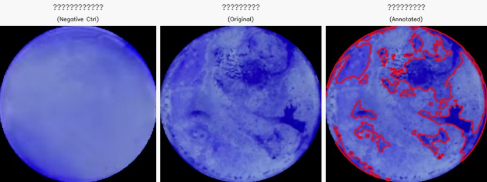

# Biofilm Quantitative Analysis

Quantify crystal violet biofilm staining from well images using the **B/(R+G+B) blue ratio** with adaptive thresholding.

## 📌 Overview

This tool automatically identifies and measures biofilm-positive regions in crystal violet-stained well images. It uses a luminance-invariant **blue ratio** metric and an adaptive threshold strategy to robustly handle varying staining intensities — from light blue to dark heavy staining.

### Key Features

- **Luminance-invariant metric** — `B/(R+G+B)` captures blue staining regardless of overall brightness; works for both light blue and dark heavily-stained areas
- **Adaptive per-image threshold** — Otsu's method finds the optimal split for each image automatically
- **Blank-reference floor** — user-defined percentile of the blank control's blue ratio distribution serves as a minimum threshold to reject false positives
- **Per-image override** — individual images can use higher percentile floors if visual inspection reveals residual false positives
- **Batch processing** — processes all images in a directory automatically
- **Dual implementation** — Python (OpenCV) and Fiji/ImageJ macro

### Metrics Reported

| Metric | Description |
|--------|-------------|
| `area_pct` | Percentage of the well area that is biofilm-positive |
| `mean_blue_ratio` | Average B/(R+G+B) value within positive regions |
| `integrated_blue_ratio` | Sum of B/(R+G+B) across all positive pixels (combines extent + intensity) |

## 🧪 Method

### 1. Blue Ratio

For each pixel, compute:

```
blue_ratio = B / (R + G + B)
```

This measures **what fraction of the total light is blue**. A value of ~0.33 means pure white/gray, ~0.5 means the blank background, and >0.7 means strongly blue-stained (biofilm-positive). Using a ratio instead of an absolute channel value makes the metric **insensitive to overall brightness**, so both light blue and dark blue regions are correctly identified.

### 2. Threshold Strategy

```
final_threshold = max(Otsu(image), percentile(blank, P))
```

- **Otsu threshold**: Automatically computed per-image from the blue ratio histogram
- **Blank P90 floor**: The 90th percentile of the blank control's blue ratio distribution serves as a lower bound — anything below this cannot be "more blue" than 90% of the blank pixels

| Scenario | Otsu result | Floor applied | Effect |
|----------|-------------|---------------|--------|
| Well-separated stained/unstained | Finds good threshold | No floor needed | Clean bimodal split |
| Uniformly stained (unimodal) | Returns 0 | P90 floor kicks in | Captures well-defined blue regions |

### 3. Post-processing

- Morphological opening + closing (5×5 kernel) to remove noise and fill small gaps
- Minimum region area filter (default: 30 px²)
- Red contour overlay on the original image

## 🚀 Usage

### Python

```bash
# Install dependencies
pip install -r requirements.txt

# Run analysis
python3 biofilm_analysis.py \
    --data_dir /path/to/your/images \
    --blank 34.png \
    --output ./results \
    --floor 90

# For specific images needing a higher floor,
# modify the floor_override dict in the script.
```

### Fiji / ImageJ

1. Open Fiji
2. `File → Open → biofilm_analysis.ijm → Run`
3. Select input and output directories when prompted
4. Results (annotated images + CSV) are saved to the output directory

## 📁 Output Structure

```
output_directory/
├── sample01_annotated.png    # Original image with red contour overlays
├── sample02_annotated.png
├── ...
├── biofilm_results.csv       # Quantitative measurements
└── summary.txt               # Text summary
```

### CSV columns

| Column | Description |
|--------|-------------|
| `filename` | Image filename |
| `floor` | Percentile floor used (e.g., P90, P97) |
| `otsu_threshold` | Otsu auto-threshold value |
| `final_threshold` | max(Otsu, blank_Pxx) |
| `center_blue_ratio` | Blue ratio at the image center |
| `area_px` | Biofilm-positive area in pixels |
| `area_pct` | Positive area as % of the well |
| `mean_blue_ratio` | Mean blue ratio within positive regions |
| `integrated_blue_ratio` | Integrated density (area × mean ratio) |
| `num_regions` | Number of contiguous positive regions |

## 📊 Sample Data



*从左到右：阴性对照（空白孔）、原始染色图像、算法自动标注结果*

The `sample_data/` folder contains the composite preview image above.
For your own analysis, provide the blank control and sample images via `--blank` and `--data_dir`.

```bash
python3 biofilm_analysis.py \
    --data_dir ./your_images \
    --blank blank_control.png \
    --output ./results
```

## 📋 Tuning Guide

If some images show false-positive light areas:

| Issue | Likely Fix |
|-------|------------|
| Light/bright areas falsely circled | Increase the percentile floor per-image via `floor_override` dict (try P97 or P99) |
| Genuine staining being missed | Decrease the floor, or check if the blank image is appropriate |
| Inconsistent results across images | Use Otsu-only mode (set `floor_default=0`) for fully auto-adaptive results |

## 📦 Dependencies

- Python 3.8+
- OpenCV (`opencv-python-headless`)
- NumPy
- Pandas
- SciPy

Or use the Fiji/ImageJ macro (no Python dependencies required).

## 📝 License

MIT

## 📬 Contact

hekunhe98@126.com
